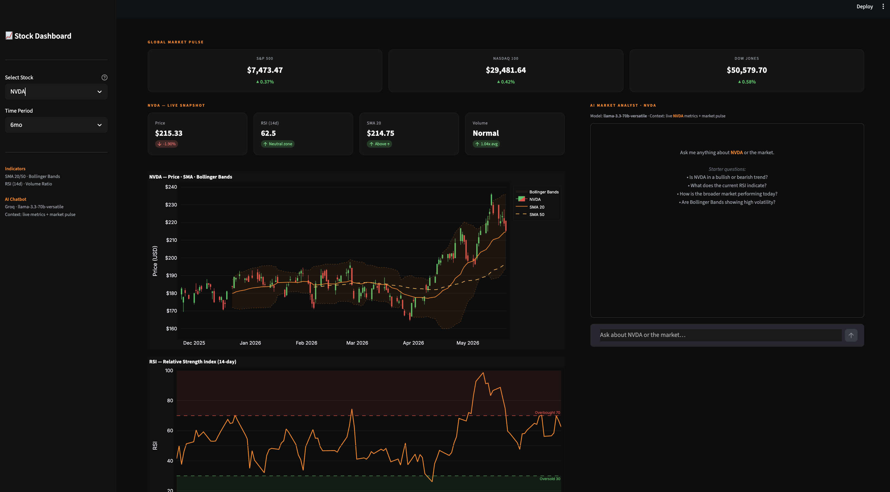
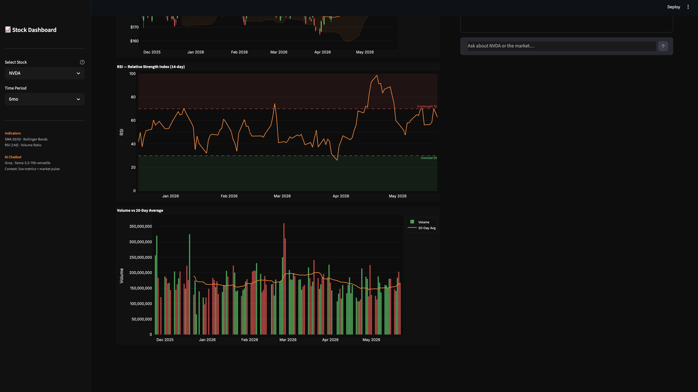

# Stock Trading Analysis Dashboard

A single-page, production-ready stock analysis dashboard built with **Streamlit**, featuring real-time technical indicators and an **AI-powered chatbot** (via Groq's free LLM API) that answers questions grounded in live market data.



---

## Features

### Global Market Pulse
Live header row showing real-time price and daily % change for the three major US indices — S&P 500, Nasdaq 100, and Dow Jones Industrial Average.

### Technical Analysis Charts
Interactive Plotly charts for any stock in the pre-built watchlist:

| Chart | Indicators |
|---|---|
| **Price** | Candlestick OHLC · SMA 20 (solid) · SMA 50 (dashed) · Bollinger Bands (±2σ shaded) |
| **RSI** | 14-day Relative Strength Index · Overbought (70) / Oversold (30) zones |
| **Volume** | Daily bars (green = up day, red = down day) · 20-day average volume line |

### Live KPI Cards
Four headline metrics always visible above the charts:
- **Price** with 1-day % change
- **RSI** with overbought/oversold label
- **SMA 20** with above/below signal
- **Volume ratio** vs 20-day average

### AI Market Analyst Chatbot
Context-aware chatbot powered by **Groq** (`llama-3.3-70b-versatile`):
- Live stock metrics **and** market pulse % changes are injected into the system prompt
- Answers asset-specific questions ("Is NVDA overbought?") and macro questions ("How is the Nasdaq today?")
- Full conversation history retained via `st.session_state` — chat survives page reruns
- Chat auto-clears when switching to a new ticker



---

## Tech Stack

| Layer | Technology |
|---|---|
| Dashboard | [Streamlit](https://streamlit.io) |
| Stock Data | [yfinance](https://github.com/ranaroussi/yfinance) |
| Data Processing | [Pandas](https://pandas.pydata.org) · [NumPy](https://numpy.org) |
| Charts | [Plotly](https://plotly.com/python/) |
| AI Chatbot | [Groq API](https://console.groq.com) · `llama-3.3-70b-versatile` |
| Env Config | [python-dotenv](https://github.com/theskumar/python-dotenv) |

---

## Architecture

Everything lives in a single `app.py` — no separate modules required:

```
app.py
│
├── fetch_market_pulse()        # Live index data (S&P, Nasdaq, Dow) — cached 1h
├── fetch_and_compute()         # OHLCV + SMA/BB/RSI/Volume indicators — cached 1h
├── extract_metrics()           # Flatten latest row into a metrics dict
├── build_context_digest()      # Build plain-text LLM context string
│
├── chart_price()               # Candlestick + SMA + Bollinger Bands
├── chart_rsi()                 # RSI with reference zones
├── chart_volume()              # Volume bars + 20-day average
│
├── get_groq_client()           # Singleton Groq client — cached per session
└── get_chat_response()         # Chat completion with injected live context
```

**Key design decision — `@st.cache_data(ttl="1h")`:** Streamlit reruns the entire script on every user interaction (including every chat keystroke). Without caching, that triggers a fresh API call on every message. The 1-hour TTL memoises on `(ticker, period)` so chart interactions and chatbot replies are instant.

---

## Getting Started

### 1. Clone the repo
```bash
git clone https://github.com/pavanmanjunath/stock-trading-dashboard.git
cd stock-trading-dashboard
```

### 2. Create a virtual environment and install dependencies
```bash
python -m venv .venv
source .venv/bin/activate        # Windows: .venv\Scripts\activate
pip install -r requirements.txt
```

### 3. Add your Groq API key
```bash
cp .env.example .env
```
Open `.env` and replace the placeholder:
```
GROQ_API_KEY=your_key_here
```
Get a **free** API key at [console.groq.com](https://console.groq.com) — no credit card required.

> The dashboard works fully without the API key — only the chatbot panel is disabled.

### 4. Run the app
```bash
streamlit run app.py
```
Open [http://localhost:8501](http://localhost:8501) in your browser.

---

## Watchlist

The sidebar dropdown includes 10 pre-loaded tickers so anyone can explore the dashboard instantly:

`AAPL` · `MSFT` · `NVDA` · `AMZN` · `GOOGL` · `META` · `TSLA` · `NFLX` · `SPY` · `AMD`

---

## Technical Indicators Explained

| Indicator | Formula | Interpretation |
|---|---|---|
| **SMA 20** | 20-day simple moving average of Close | Short-term trend direction |
| **SMA 50** | 50-day simple moving average of Close | Medium-term trend direction |
| **Bollinger Bands** | SMA 20 ± 2 standard deviations | Volatility envelope; price near upper = stretched, near lower = compressed |
| **RSI** | 14-day Wilder RSI | >70 overbought, <30 oversold, 50 = neutral |
| **Volume Ratio** | Today's volume ÷ 20-day avg volume | >2x signals potential institutional activity |

---

## Requirements

```
streamlit>=1.35.0
yfinance>=0.2.40
pandas>=2.0.0
plotly>=5.22.0
groq>=0.9.0
python-dotenv>=1.0.0
numpy
```

---

## License

MIT — free to use, modify, and distribute.
